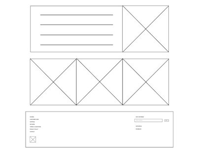
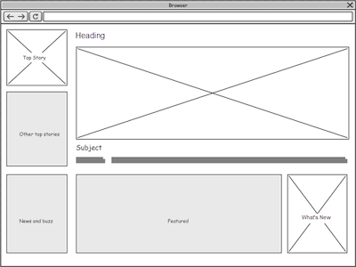

# Personal Website Template
We react website template. This template will be used to sell personalize d websites to artists, attorneys, web developers, travel bloggers, and more.

### Motivation
This application is built with the intended purpose to use as a sales too to build out personal websites that can be tailored to meet an individuals brand.

### Customer
##### Customer 1: My Customer the Artist
The artist/customer is one who is looking to get a personal website to reflect their brand.  Each template should be designed with my customer's customer in mind. 

##### Customer 2: Customer's Customer
The customer's customer is the person who will be viewing the final product.  Each template should have our customer's customer in mind as we think through functionality and design.

---
### Screenshots
screen captures of your app

---
### User Stories
MVP Two Templates: 
- Artist:
    * Artists template should be artist/art focused.  The center should be the artists headshot or artwork. 
    * Customer 2 should be able to contact the artist directly for commissions or to be hired.
    * Artist should have a spot for a brief bio
    * Artist should ahve a spot for spot to showcase artwork and product offerings.
        - if the artist has a product the site should include pricing and opportunities for customer 2 to purchase the product
    * Stretch: 
        - Artist should have some drag and drop capability.  If possible artist should log in and be able to update a headshot or bio
        - Artist should be able to update products.
- Professional:
    * Think: Attorney, Therapists, Web Developers, Graphic Designers, Freelancers
    * Professional should showcase their practice or the work that they do.  Front page should be clear what service do you provide.
    * Professional should have a contact page. 
    * Professional have an aboutMe page. 
        - about me should be most descript as it includes professionals "CV" clearly
    * Artist should have a space to showcase services offerred included pricing structures and ways to contact.
    * Stretch: 
        - Drag and drop and edit capabilities.

### Wireframes
The planning materials used to build this app.
* High-level user stories.
* image files of wireframes

---
### Technologies & Code Snippets
* list of technologies
* screen captures of your code

---
### Credits
Give credit to any `codepen` that inspired you, `medium` article that helped you, or `stackoverflow` that pointed you in the right direction.

---

### Future development
What are the next steps for the project? How will you continue to evolve it?
